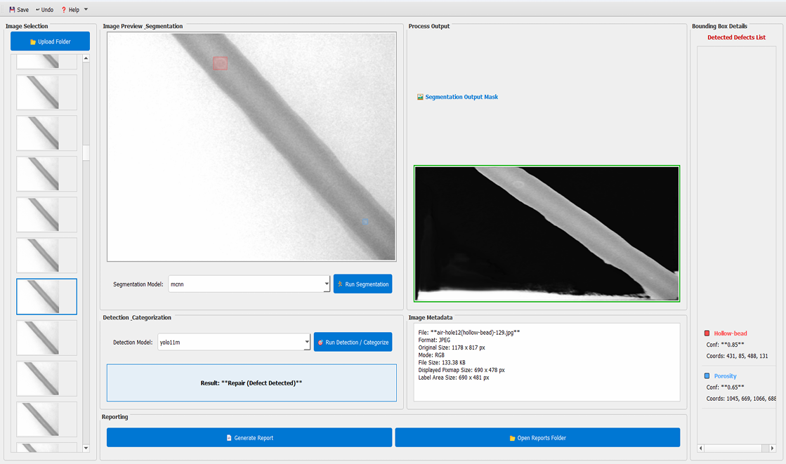

**Welding Defect Detection System**

**Overview**

A desktop GUI-based application for automated welding defect detection using semantic segmentation and object detection models.
This system is designed for real-time industrial inspection and runs efficiently on edge devices like NVIDIA Jetson Orin Nano.
Detects, localizes, and classifies welding defects from X-ray images.

---

**Key Features**

- User-friendly Desktop GUI (PyQt).
- Upload and preview image datasets.
- Multiple Segmentation Models:
  - U-Net, mcnn , SegFormer.
- Detection Models:
  - YOLO (v8, v11, v12).
- Real-time defect visualization with bounding boxes.
- Automated PDF report generation.
- Metadata extraction for traceability.
- Runs on edge device (Jetson Orin Nano).

---

**System Workflow**

1. Upload welding X-ray images.  
2. Select segmentation model → generate mask.  
3. Run detection → identify defects.  
4. Visualize defects + bounding boxes.  
5. Generate inspection report.  

---

**GUI Preview**

The GUI provides image preview, segmentation output, detection results, and metadata in a single interface.

---

**Models Used**

**Segmentation Models**
- U-Net
- SegFormer
- mcnn
- FPN, MAnet, LinkNet, DPT
These models perform pixel-level defect localization.

**Detection Models** 
- YOLOv8, YOLOv11, YOLOv12
Used for:
- Bounding box detection  
- Defect classification  

---

**Hardware Setup**

- NVIDIA Jetson Orin Nano (8GB)
- 128GB SD Card
- Portable Power Supply
Enables real-time edge AI processing without cloud dependency :contentReference[oaicite:0]{index=0}

---

**Contributors**

-Anushree Verma
-Osheen Mahajan
-Riddhi Maheshwari
-Tanvi Champatasingh
-Disha Lohani
